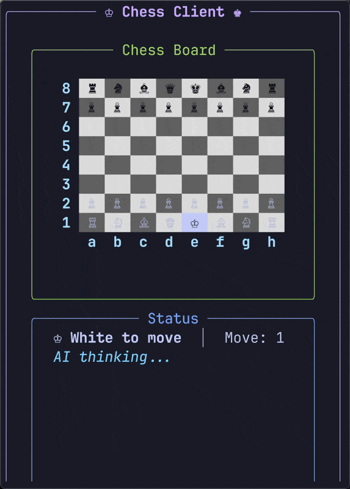
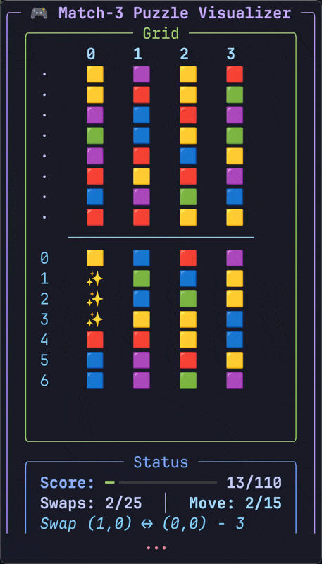
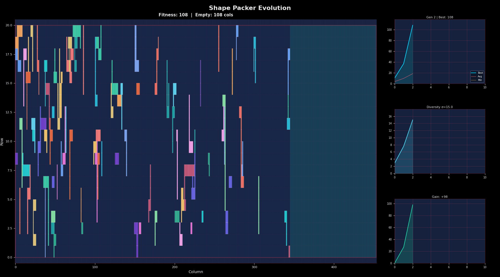
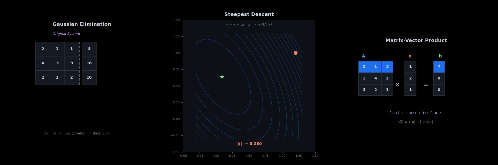
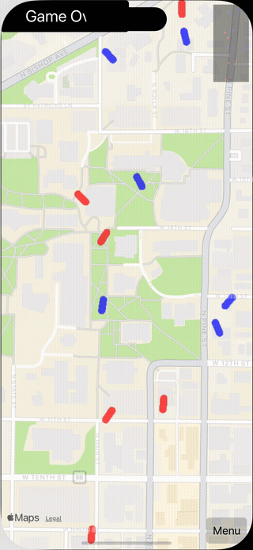
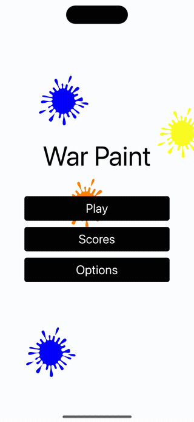
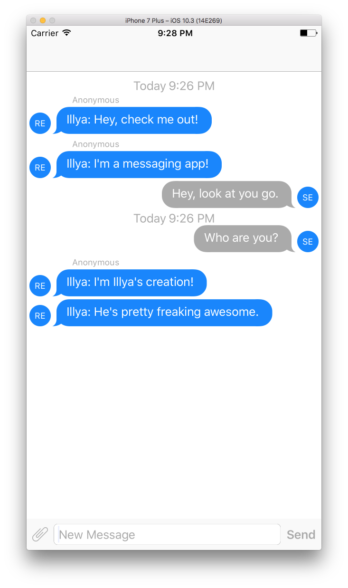
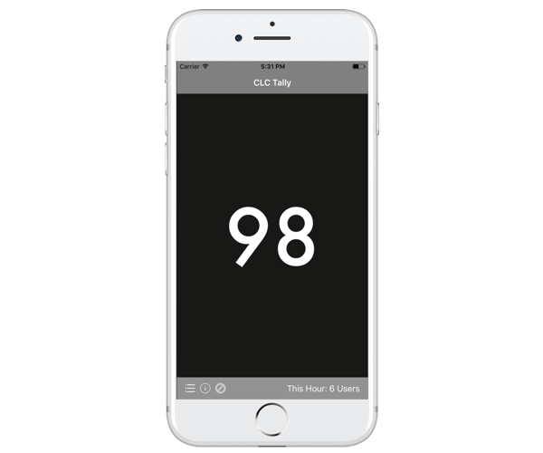

# Portfolio

A curated selection of projects that represent the best work in this repository.

## Documents

Course notes and assignments typeset in LaTeX—the standard for academic and scientific writing. Mathematical notation, diagrams, and code listings rendered properly. Four compilations covering different subsets of the material.

| Document | Pages | Description |
|----------|------:|-------------|
| [Curated](latex/curated.pdf) | 224 | Curated selection of best work |
| [Assignments](latex/assignments.pdf) | 276 | Homework assignments with solutions |
| [Notes](latex/notes.pdf) | 450 | Lecture notes and study materials |
| [Complete](latex/complete.pdf) | 850 | Complete collection: assignments + notes |

## 1. Chess AI

**Path:** `src/cs5400-artificial-intelligence/game-series/`

Built a chess engine from scratch using bitboards—64-bit integers where each bit represents a square. Move generation becomes pure bitwise operations: shifts for sliding pieces, masks to prevent board wraparound. Combined with alpha-beta pruning, iterative deepening, and a custom evaluation function considering piece positioning, king safety, and pawn structure. Four iterations, each faster than the last.

<p align="center">
  
</p>

## 2. Puzzle Solvers

**Path:** `src/cs5400-artificial-intelligence/puzzle-series/`

Four puzzle solvers using various search algorithms. The standout is the A* implementation with custom heuristics that solves complex state-space problems efficiently. Each puzzle required thinking carefully about state representation and admissible heuristics. Watching the solver find optimal paths through thousands of states in milliseconds was deeply satisfying.

<p align="center">
  
</p>

## 3. Shape Packer

**Path:** `src/cs5401-evolutionary-computing/`

Evolutionary algorithm for 2D shape packing. Given a set of irregular shapes and a rectangular board, find the optimal placement that maximizes coverage. The EA uses fitness proportional selection, k-tournament selection (with and without replacement), and truncation for survival. Shapes can rotate and translate—the genome encodes position and orientation for each piece. Mutation perturbs placements; recombination swaps shape configurations between parents. Watching generations converge on tight packings is mesmerizing.

<p align="center">
  
</p>

## 4. Linear Algebra Library

**Path:** `src/cs5201-object-oriented-numerical-modeling-ninjas/`

A templated C++ linear algebra library. Supports matrices, vectors, and various decompositions (LU, QR, Cholesky). Heavy use of operator overloading to make matrix math read naturally. The final project ties it all together to solve systems of linear equations with different numerical methods.

<p align="center">
  
</p>

## 5. CFG Tracer

**Path:** `src/cs4099-undergrad-research/`

Undergraduate research project that instruments C++ code to trace control flow at runtime. A control flow graph (CFG) represents all possible execution paths through a program—nodes are basic blocks (straight-line code with no branches), edges are jumps between them. This tool parses source files, identifies basic blocks, and generates execution traces. Used Boost for regex parsing. The goal was to understand how programs actually execute versus how we think they execute.

## 6. Splatoonio

**Path:** `src/cs4096-software-systems-development/splatoonio`

<p align="center">
  
  &nbsp;&nbsp;
  
</p>

Capstone project—a location-based multiplayer paint game for iOS, inspired by Splatoon. Built with Swift + UIKit + MapKit: the map is a grid of 1 m² tiles anchored to real GPS coordinates, and players "paint" tiles by walking over them. Territory is scored by tile ownership at end-of-round. Real-time state sync with a Python server, custom `MKOverlayRenderer` driving a CGBitmap for the paint layer, and a CoreLocation pipeline that filters and smooths GPS updates to keep painting responsive. The kind of project where you learn that 80% of software engineering is communication and coordination.

## 7. Space Invaders

**Path:** `src/cpe3150-micro-embedded-design/project-3/code/space-invaders`

<p align="center">
  
</p>

Space Invaders running on an 8051 microcontroller. Written in assembly and C, pushing against tight memory constraints. Every byte mattered. Implementing smooth sprite movement and collision detection on hardware this limited teaches you what efficiency really means.

## 8. Camelot

**Path:** `src/cs3100-software-engineering-i/camelot`

Team software engineering project with full documentation, UML diagrams, and Doxygen-generated API docs. Practiced agile methodology, code reviews, and collaborative development. The code itself is less interesting than learning how to build software with other people.

An optional iOS chat client (`src/cs3800-operating-systems/homework-3/SocketServer`) hooks into the server, allowing real-time messaging between users. Built with Swift using JSQMessagesViewController for the chat UI and SwiftSocket for TCP communication.

<p align="center">
  
</p>

## 9. CLC Tally

**Path:** `src/clc-tally`

<p align="center">
  
</p>

iOS app for tracking student headcounts at Missouri S&T's Computer Learning Center. Built to solve a real problem—tutors needed a quick way to log how many students they helped. Simple interface, local storage, export functionality. Sometimes the best software is the software that just works.

## 10. Grading Suite

**Path:** `src/cs1570-grading-suite`

Automated grading tools for CS 1570 intro programming course. Style checker enforces coding standards, roster checker validates submissions, and the grader script runs test cases. Built out of necessity when grading hundreds of student submissions by hand became unsustainable.

<details>
<summary>Sample Output</summary>

```
$ python3 stylechecker.py bad_homework.cpp bad_homework.h

## bad_homework.cpp

**80 Column Rule**

- Line 25: `cout << "The result is: " << result << " and this line is very long...`

**Tabs**

- Line 22: `int x = 5;`
- Line 23: `int y = 10;`

**Non-Uppercase Constants**

- Line 6: `const int maxValue = 100;`
- Line 7: `const float pi_value = 3.14159;`

## bad_homework.h

**Missing Documentation (2 Functions, 1 Lines of Comments)**

- Line 0: ``

**Header Guards Don't Match**

- Line 3: `#ifndef WRONG_NAME`

**Header Guards Are Incorrect Format**

- Line 4: `#define ALSO_WRONG`
```

</details>

---

## Metrics

Statistics for academic coursework from Missouri S&T (2014-2018).

> **Note:** Some projects excluded from metrics.

### Summary

| Metric | Value |
|--------|-------|
| Courses | 25 |
| Total Commits | 545 |
| Total Files | 1,826 |
| Lines of Code | 91,512 |
| Languages | 9 |

### Lines of Code by Language

1. **TeX** - 31,043 lines
2. **C/C++ Header** - 28,235 lines
3. **C++** - 17,246 lines
4. **SQL** - 11,184 lines
5. **Python** - 7,758 lines
6. **C** - 2,667 lines
7. **Shell** - 1,513 lines
8. **Assembly** - 656 lines
9. **MATLAB** - 337 lines
10. **R** - 156 lines

<details>
<summary>Full breakdown</summary>

```
Language                          files          blank        comment           code
------------------------------------------------------------------------------------
TeX                                 460           8075           1270          31043
C/C++ Header                        301           8515          12349          28235
C++                                 283           4809           3276          17246
SQL                                  21            170             65          11184
Python                              131           2986           2405           7758
C                                    21            626            547           2667
Bourne Shell                         35            207            174           1489
Java                                 23            407            674           1297
Assembly                              2            119             37            656
make                                 22            192             42            643
Swift                                10            162            107            375
MATLAB                               16            139             95            337
R                                     7             29              6            156
Bourne Again Shell                    7              8              0             24
Lisp                                  1             12             19             61
------------------------------------------------------------------------------------
SUM:                               1347          26456          21066          91512
```

</details>

### Contributions by Author

| Author                 |     loc |   coms |   fils |  distribution   |
|:-----------------------|--------:|-------:|-------:|:----------------|
| Illya Starikov         | 3462894 |    342 |   1564 | 96.0/64.3/56.7  |
| Tim Ott                |    1706 |     20 |     33 | 0.0/ 3.8/ 1.2   |
| Ian Howell             |    1279 |      5 |      9 | 0.0/ 0.9/ 0.3   |
| Claire Trebing         |    1087 |     29 |     32 | 0.0/ 5.5/ 1.2   |
| Zachary Wileman        |     469 |      8 |      9 | 0.0/ 1.5/ 0.3   |
| Michael Schoen         |     284 |      1 |      1 | 0.0/ 0.2/ 0.0   |
| Abdirahman Ahmed Osman |      87 |      5 |      4 | 0.0/ 0.9/ 0.1   |
| Adam Evans             |      48 |     21 |      5 | 0.0/ 3.9/ 0.2   |
| Eric Michalak          |       0 |      4 |      0 | 0.0/ 0.8/ 0.0   |
| Michael Harrington     |       0 |     13 |      0 | 0.0/ 2.4/ 0.0   |

**Total:** 448 commits, 3,467,854 loc, 1,657 files

*Distribution format: loc% / commits% / files%*

### Commit Activity by Hour

```
+-------------------------------------------------------+
| Commit Activity by Hour                               |
+-------------------------------------------------------+
| Hour   | Commits | Distribution                       |
+-------------------------------------------------------+
| 00:00  |      14 | ███████                            |
| 01:00  |       4 | ██                                 |
| 02:00  |      11 | ██████                             |
| 03:00  |       5 | ██                                 |
| 04:00  |       0 |                                    |
| 05:00  |       0 |                                    |
| 06:00  |       0 |                                    |
| 07:00  |       4 | ██                                 |
| 08:00  |       7 | ███                                |
| 09:00  |      32 | █████████████████                  |
| 10:00  |      34 | ██████████████████                 |
| 11:00  |      30 | ████████████████                   |
| 12:00  |      28 | ███████████████                    |
| 13:00  |      21 | ███████████                        |
| 14:00  |      31 | ████████████████                   |
| 15:00  |      24 | █████████████                      |
| 16:00  |      36 | ███████████████████                |
| 17:00  |      20 | ██████████                         |
| 18:00  |      25 | █████████████                      |
| 19:00  |      40 | █████████████████████              |
| 20:00  |      41 | ██████████████████████             |
| 21:00  |      64 | █████████████████████████████████  |
| 22:00  |      44 | ████████████████████████           |
| 23:00  |      16 | ████████                           |
+-------------------------------------------------------+
| Total commits: 545                                    |
+-------------------------------------------------------+
```

Peak activity: **9 PM (21:00)** with 64 commits

### Commit Timeline

```
                           COMMIT TIMELINE
                       January 2014 — April 2018
──────────────────────────────────────────────────────────────────────

2014 │░                                                             1
     │
2015 │░░░░░                                                         5
     │
     │          J   F   M   A   M   J   J   A   S   O   N   D
2016 │          ░   ░   ██████████████████░   ░   ░   ████████    163
     │                  43  48  40                 16   8
     │
     │          J   F   M   A   M   J   J   A   S   O   N   D
2017 │          ░░████████████████████░       ░░██████████░░░░    176
     │           9  28  31  62  17        11  27  19  11
     │
     │          J   F   M   A
2018 │          ████████████████████████████████████░░░░          170
     │          40  56  51  23
     │
──────────────────────────────────────────────────────────────────────
                                                      Total: 515

Peak: April 2017 (62 commits) — Junior year crunch
```

### Language Evolution

```
                          LANGUAGE EVOLUTION
──────────────────────────────────────────────────────────────────────

2014    ┌─────────┐
        │   C++   │
        └─────────┘
              │
              ▼
2015    ┌─────────┬─────────┐
        │   C++   │  LaTeX  │
        └─────────┴─────────┘
              │
              ▼
2016    ┌─────────┬─────────┬─────────┬─────────┐
        │   C++   │  LaTeX  │   SQL   │  Shell  │
        └─────────┴─────────┴─────────┴─────────┘
              │
              ▼
2017    ┌───────┬───────┬───────┬───────┬───────┬───────┬───────┐
        │  C++  │ Python│  ASM  │  SQL  │ Shell │ MATLAB│ LaTeX │
        └───────┴───────┴───────┴───────┴───────┴───────┴───────┘
              │
              ▼
2018    ┌─────┬─────┬─────┬─────┬─────┬─────┬─────┬─────┬─────┐
        │ C++ │  Py │ ASM │ SQL │  Sh │ MAT │ TeX │  R  │Swift│
        └─────┴─────┴─────┴─────┴─────┴─────┴─────┴─────┴─────┘

──────────────────────────────────────────────────────────────────────
                           9 languages by graduation
```

### Activity Heatmap

```
                          ACTIVITY HEATMAP
──────────────────────────────────────────────────────────────────────

          Jan  Feb  Mar  Apr  May  Jun  Jul  Aug  Sep  Oct  Nov  Dec
        ┌────┬────┬────┬────┬────┬────┬────┬────┬────┬────┬────┬────┐
   2014 │  ░ │    │    │    │    │    │    │    │    │    │    │    │
        ├────┼────┼────┼────┼────┼────┼────┼────┼────┼────┼────┼────┤
   2015 │    │    │  ░ │    │    │    │    │    │    │    │  ░ │  ░ │
        ├────┼────┼────┼────┼────┼────┼────┼────┼────┼────┼────┼────┤
   2016 │  ░ │  ░ │ ██ │ ██ │ ██ │    │  ░ │    │    │  ░ │  ▒ │  ░ │
        ├────┼────┼────┼────┼────┼────┼────┼────┼────┼────┼────┼────┤
   2017 │  ░ │ ▒▒ │ ▒▒ │ ██ │  ▒ │    │    │  ▒ │ ▒▒ │  ▒ │  ░ │  ░ │
        ├────┼────┼────┼────┼────┼────┼────┼────┼────┼────┼────┼────┤
   2018 │ ██ │ ██ │ ██ │ ▒▒ │    │    │    │    │    │    │    │    │
        └────┴────┴────┴────┴────┴────┴────┴────┴────┴────┴────┴────┘

──────────────────────────────────────────────────────────────────────
             ░ 1-10     ▒ 11-30     █ 31-50     ██ 51+

                   Spring semesters: Jan-May
                     Fall semesters: Aug-Dec
```

### Lines of Code by Year

```
                     LINES OF CODE BY YEAR
──────────────────────────────────────────────────────────

      2014       2015       2016       2017       2018
        │          │          │          │          │
        │          │          │          │      ████████
        │          │          │          │      ████████
        │          │          │      ████████   ████████
        │          │          │      ████████   ████████
        │          │      ████████   ████████   ████████
        │          │      ████████   ████████   ████████
        │      ████████   ████████   ████████   ████████
    ████████   ████████   ████████   ████████   ████████
  ────────────────────────────────────────────────────────
      ~2k       ~10k       ~20k       ~25k       ~35k

───────────────────────────────────────────────────────────────
            91,512 lines across 9 languages
```

---

## Code Highlights

A collection of code snippets that showcase interesting techniques, clever solutions, and the occasional moment of personality.

### Lazy Move Generator

**Source:** `src/cs5400-artificial-intelligence/puzzle-series/2018-sp-a-puzzle_4-isgx2/src/mechanical_match.py:111-149`

Python's generators let you build lazy sequences that compute values on demand. Here, instead of generating all possible moves upfront and storing them in a list, the generator yields valid moves one at a time. Memory stays flat regardless of how many possible moves exist—only the ones we actually use get computed.

```python
@staticmethod
def actions(state):
    # This is ugly, but by abusing list comprehension, I get lazy evaluation.
    # In turn, I actually do a linear search of the entire space, but only store
    # the states that are legal. Thank you, generators.

    row_max, column_max = MechanicalMatch.grid_size(state.grid)

    return [] if state.swaps >= state.max_swaps else (
        Action((row, column), direction)
        for row in range(0, row_max)
        for column in range(0, column_max)
        for direction in [Direction.UP, Direction.LEFT]
        if MechanicalMatch.swap_is_valid(state.grid, (row, column), direction)
    )
```

### Bitboard Move Generation

**Source:** `src/cs5400-artificial-intelligence/game-series/2018-sp-a-game-4-isgx2/Joueur.cpp/games/chess/chess-ai/src/chess-engine.cpp`

Bitboards encode a chess position as a 64-bit integer—one bit per square. Move generation becomes pure bitwise operations. The `moving` function shifts bits to simulate piece movement, masking edge files to prevent wraparound. Each piece type builds on this primitive.

```cpp
Bitboard MoveEngine::moving(const Bitboard& board, const Direction& direction) {
    const static Bitboard aFileInverse = 0xfefefefefefefefe;
    const static Bitboard hFileInverse = 0x7f7f7f7f7f7f7f7f;

    switch (direction) {
        case north:     return board << 8;
        case south:     return board >> 8;
        case east:      return (board << 1) & aFileInverse;
        case west:      return (board >> 1) & hFileInverse;
        case northeast: return (board << 9) & aFileInverse;
        case northwest: return (board << 7) & hFileInverse;
        case southeast: return (board >> 7) & aFileInverse;
        case southwest: return (board >> 9) & hFileInverse;
        default:        return Bitboard();
    }
}
```

King moves combine all eight directions, masked against friendly pieces:

```cpp
Bitboard MoveEngine::kingMoves(const Bitboard& king, const Bitboard& self) {
    return (moving(king, north)
          | moving(king, south)
          | moving(king, east)
          | moving(king, west)
          | moving(king, northeast)
          | moving(king, northwest)
          | moving(king, southeast)
          | moving(king, southwest))
          & (~self);
}
```

Knights require special handling—the L-shape jumps need different file masks to prevent wrapping across the board edges:

```cpp
Bitboard MoveEngine::knightMoves(const Bitboard& knight, const Bitboard& self) {
    const static Bitboard aFileInverse  = 0xfefefefefefefefe;
    const static Bitboard hFileInverse  = 0x7f7f7f7f7f7f7f7f;
    const static Bitboard abFileInverse = 0xfcfcfcfcfcfcfcfc;
    const static Bitboard ghFileInverse = 0x3f3f3f3f3f3f3f3f;

    return (((knight << 17) & aFileInverse)
          | ((knight >> 15) & aFileInverse)
          | ((knight << 15) & hFileInverse)
          | ((knight >> 17) & hFileInverse)
          | ((knight << 10) & abFileInverse)
          | ((knight >>  6) & abFileInverse)
          | ((knight >> 10) & ghFileInverse)
          | ((knight <<  6) & ghFileInverse))
          & (~self);
}
```

Sliding pieces (rooks, bishops, queens) ray-cast until hitting a blocker. Shifts repeat 7 times—the maximum squares a piece can slide:

```cpp
Bitboard MoveEngine::northMovesWithBlockers(Bitboard board, const Bitboard& blockerInverse) {
    auto result = board;
    result |= board = (board << 8) & blockerInverse;
    result |= board = (board << 8) & blockerInverse;
    result |= board = (board << 8) & blockerInverse;
    result |= board = (board << 8) & blockerInverse;
    result |= board = (board << 8) & blockerInverse;
    result |= board = (board << 8) & blockerInverse;
    result |= board = (board << 8) & blockerInverse;
    return result;
}
```

Pawns are the most complex—different move patterns for each color, double-moves from starting rank, diagonal captures only when enemies present:

```cpp
Bitboard MoveEngine::pawnMoves(const Bitboard& pawn, Bitboard self,
                               Bitboard enemy, const Color& selfColor) {
    const auto enemyOriginal = enemy;
    self = ~self;
    enemy = ~enemy;

    static Bitboard secondRank = 0xff00;
    static Bitboard seventhRank = 0xff000000000000;

    if (selfColor == white) {
        return (pawnNorthMovesWithBlockers(pawn, self & enemy)
              | pawnNorthNorthMovesWithBlockers(pawn & secondRank, self & enemy)
              | (moving(pawn, northeast) & enemyOriginal)
              | (moving(pawn, northwest) & enemyOriginal))
            ^ pawn;
    } else {
        return (pawnSouthMovesWithBlockers(pawn, self & enemy)
              | pawnSouthSouthMovesWithBlockers(pawn & seventhRank, self & enemy)
              | (moving(pawn, southeast) & enemyOriginal)
              | (moving(pawn, southwest) & enemyOriginal))
            ^ pawn;
    }
}
```

### Newton Interpolation with Divided Differences

**Source:** `src/cs5201-object-oriented-numerical-modeling-ninjas/2018-sp-a-hw4-isgx2/src/polynomial-interpolation.hpp:131-148`

Polynomial interpolation lets you find a curve that passes through a set of points. This lambda captures the divided difference table and evaluates the Newton form of the interpolating polynomial at any x value. The nested loop multiplies by successive `(x - x_i)` terms—the building blocks of Newton's formula.

```cpp
auto lambda = [&](const T x) {
    calculateDividedDifferenceTable();

    auto mainDiagonal = (*dividedDifferenceTable).mainDiagonal();
    auto total = points[0].second;

    for (int i = 0; i < (*dividedDifferenceTable).magnitude(); i++) {
        auto accumulator = mainDiagonal[i];

        for (int j = 0; j <= i; j++) {
            accumulator *= x - points[j].first;
        }

        total += accumulator;
    }

    return total;
};
```

### Polar Pair Equality

**Source:** `src/cs5201-object-oriented-numerical-modeling-ninjas/2018-sp-a-hw2-isgx2/src/lib/polarpair.hpp:229-236`

Two polar coordinates can represent the same point in multiple ways. `(r, θ)` equals `(r, θ + 2πn)` for any integer n, and `(-r, θ)` equals `(r, θ + π)`. This equality operator handles all the edge cases with floating-point tolerance. Yes, it's a single return statement. No, I'm not sorry.

```cpp
return (std::fabs(this->getModulus() - rightHandSide.getModulus()) < EPSILON
            && std::fabs(this->getArgument() - rightHandSide.getArgument()) < EPSILON)
    || (std::fabs(this->getModulus() - rightHandSide.getModulus()) < EPSILON
            && std::fabs(std::fmod(this->getArgument(), 2.0 * pi)
                       - std::fmod(rightHandSide.getArgument(), 2.0 * pi)) < EPSILON)
    || (std::fabs(this->getModulus() + rightHandSide.getModulus()) < EPSILON
            && std::fabs(std::fmod(this->getArgument(), 2.0 * pi)
                       - std::fmod(pi + rightHandSide.getArgument(), 2.0 * pi)) < EPSILON);
```

### Extended Euclidean Algorithm

**Source:** `src/cs5200-analysis-of-algorithms/homework-1/source/question-7.py`

The classic GCD algorithm, but this version also returns Bézout coefficients—integers `s` and `t` such that `as + bt = gcd(a,b)`. Useful for modular arithmetic, RSA, and impressing people at parties.

```python
def gcd2(a, b):
    if a == 0:
        return (b, 0, 1)
    else:
        g, s, t = gcd2(b % a, a)
        return [g, t - (b // a) * s, s]
```

### K-Way Merge with a Heap

**Source:** `src/cs5200-analysis-of-algorithms/homework-8/source/problem-3.py:84-110`

Merging k sorted lists efficiently. A min-heap tracks the smallest element from each list. Pop the minimum, push the next element from that list. O(n log k) instead of the naive O(nk). The `defaultdict` handles duplicate values elegantly by letting multiple lists share the same key.

```python
def k_way_merge(enumerables):
    heap_values = defaultdict(list)
    heap = MinHeap()
    solution = []

    for list_ in enumerables:
        list_ = sorted(list_)
        min_value = list_.pop(0)
        heap_values[min_value].append(list_)

    heap.heapify(list(heap_values.keys()))

    while len(heap) > 0:
        minimum = heap.delete_min()
        solution.append(minimum)

        minimum_list = [] if heap_values[minimum] == [] else heap_values[minimum][-1]
        del heap_values[minimum]

        if minimum_list != []:
            new_minimum = minimum_list.pop(0)
            heap_values[new_minimum].append(minimum_list)
            heap.insert(new_minimum)

    return solution
```

### 8051 Random Number Generator

**Source:** `src/cpe3150-micro-embedded-design/project-1/code/project1.a51:314-331`

Pseudo-random number generation in assembly for an 8051 microcontroller. Uses a linear feedback shift register (LFSR) approach with the polynomial taps at bits 7, 5, 4, and 3. The magic `#10111000B` mask selects these bits for the XOR. Divides by 8 and adds 1 to get a result from 1-9 for the game.

```assembly
; note this a port from http://pjrc.com/tech/8051/rand.asm
; returns a random value in the A register from 0 to 9, inclusive.
; note needs a seed value (equated at the top)
RNG:
    MOV  A, RANDREG
    JNZ  RAND8B
    CPL  A
    MOV  RANDREG, A
RAND8B:
    ANL  A, #10111000B
    MOV  C, PSW.0
    MOV  A, RANDREG
    RLC  A
    MOV  RANDREG, A
    MOV  B, #8D
    DIV  AB
    MOV  A, B
    INC  A
    RET
```

### Power of Two Check

**Source:** `src/cs3800-operating-systems/homework-2/source-code/functions.py:33-34`

The classic bit trick. A power of two in binary has exactly one bit set. Subtracting 1 flips all the lower bits. AND them together and you get zero—if and only if the original was a power of two. One line, constant time, no loops.

```python
def isPowerOfTwo(number):
    return number != 0 and ((number & (number - 1)) == 0)
```

### [How I Met Your Mother](https://en.wikipedia.org/wiki/How_I_Met_Your_Mother) Reference

**Source:** `src/cpe3150-micro-embedded-design/project-3/code/space-invaders/functions.h:42-44`

Barney Stinson would be proud. A delay function declaration that spans three lines for comedic effect.

```c
// It's gonna be legend..
void waitForIt(unsigned char seconds);
// ..ary! Legendary.
```

### [Fifty Shades of Gray](https://en.wikipedia.org/wiki/Fifty_Shades_of_Grey) Code

**Source:** `src/cs1200-discrete-math/Homework #4/Homework #4/Functions.cpp:126-127`

Sometimes you just need to leave a comment that makes future-you smile.

```cpp
displayColumnBreak("Gray Conversion"); // 50 Shades of Gray Conversions
```

### Boolean Soup

**Source:** `src/cs1570-intro-to-programming/Homework6/WavelengthCalculator5001.h:54`

When your intro programming assignment involves soup and you need a boolean for it. Was listening to [Bowling For Soup](https://en.wikipedia.org/wiki/Bowling_for_Soup) when writing this line.

```cpp
bool funcSoupIsHomemade(); // lol. boolean soup.
```

### The Apologetic Parser

**Source:** `src/cs5400-artificial-intelligence/game-series/2018-sp-a-game-4-isgx2/Joueur.cpp/games/chess/chess-ai/src/fen-parser.cpp:12-31`

FEN (Forsyth-Edwards Notation) is how you represent a chess position as a string. Parsing it requires a regex that looks like someone smashed their keyboard. The apology is warranted. The error message is... honest.

```cpp
std::string FenParser::getToken(const FenToken& token) {
    // lol sorry
    const auto regexString =
        R"((([pPnNbBrRqQkK0-8]{1,8}/?){8})\s*(w|b)\s*([KQkq-]{0,4})\s*([a-hA-H0-8\-]{1,2})\s*(\d+)\s*(\d+)*)";
    auto regexExpression = std::regex(regexString);
    auto match = std::smatch();

    if (std::regex_search(fenString, match, regexExpression)) {
        switch (token) {
            case board:       return match[1];
            case colorAtPlay: return match[3]; // don't ask why it's off by one, regex error
            case castling:    return match[4];
            case enPassant:   return match[5];
            case halfTurns:   return match[6];
            case fullTurns:   return match[7];
            default:          throw std::logic_error("Fen String is fucking broke");
        }
    } else {
        throw std::logic_error("Fen String is fucking broke");
    }
}
```

### [Collatz Conjecture](https://en.wikipedia.org/wiki/Collatz_conjecture) Tester

**Source:** `src/cs1200-discrete-math/Homework #2/Homework 2/main.cpp`

One of math's famous unsolved problems: does every positive integer eventually reach 1 under the Collatz sequence? This tests ranges of numbers, calling them "magic" if they reach 1. The ternary-in-a-do-while is peak early-CS-student energy.

```cpp
do {
    instanceOfCounter % 2 == 0 ? instanceOfCounter /= 2 : (instanceOfCounter *= 3) += 1;
    if (numberOfIteration > i * 10) { counterExampleHasBeenFound = true; }
} while (instanceOfCounter > i - 1 && !counterExampleHasBeenFound);

(!counterExampleHasBeenFound)
    ? cout << "\nAll positive integers in this set are magic.\n"
    : cout << "\nOne or more positive integers in this set are not magic.\n";
```

### [Monty Hall](https://en.wikipedia.org/wiki/Monty_Hall_problem) Simulation

**Source:** `src/cs1200-discrete-math/Homework #5/Homework #5/MontyHall.cpp`

The famous probability puzzle: you pick a door, the host opens another door showing a goat, should you switch? This simulator runs thousands of games to prove empirically that switching wins ~67% of the time. Probability is weird.

```cpp
void MontyHallGame::play() {
    int winningSpot, yourSpot, spotThatIsTakenAway;
    int switchCounter = 0, stayCounter = 0;

    for (int i = 0; i < numberOfGames; i++) {
        winningSpot = randomArbitrary(1, numberOfDoors);

        do {
            spotThatIsTakenAway = randomArbitrary(2, numberOfDoors);
        } while (spotThatIsTakenAway == winningSpot);

        do {
            yourSpot = randomArbitrary(2, numberOfDoors);
        } while (yourSpot == spotThatIsTakenAway);

        if (winningSpot == yourSpot) {
            switchCounter++;
        } else if (winningSpot == 1) {
            stayCounter++;
        }
    }

    reportTheResults(switchCounter, stayCounter);
}
```

### Steepest Descent Solver

**Source:** `src/cs5201-object-oriented-numerical-modeling-ninjas/2018-sp-a-hw6-isgx2/src/steepest-descent-solver.hpp`

Iterative linear system solver that follows the gradient downhill until it converges. The initial guess is just the `b` vector because "why not." Clean numerical code with proper error handling for non-diagonally-dominant matrices.

```cpp
template <typename T>
Vector<T> SteepestDescentSolver<T>::operator()(const SymmetricMatrix<T>& A,
                                               const Vector<T> b) {
    auto x = b; // initial guess is the b vector, cause why not
    auto alpha = T();

    unsigned i = 0;
    auto residual = b - (A * x);

    if (!isDiagonallyDominant(A)) {
        throw NonDiagonallyDominantMatrixError();
    }

    while (norm(residual) > EPSILON && i++ < MAX_ITERATIONS) {
        residual = b - (A * x);
        alpha = (residual * residual) / ((A * residual) * residual);
        x += alpha * residual;
    }

    return x;
}
```

### Random User Generator

**Source:** `src/cs2300-databases/Database Code/C++/Random SQL Generator/Users.cpp`

Generates realistic fake users for database testing. Combines random first names, adds "the" sometimes, appends numbers occasionally—just like real usernames. Heights between 4-6 feet, passwords 8-15 characters, ages 18+. The attention to realistic constraints is oddly satisfying.

```cpp
Username = importFromFile(USER_USERNAME_FILENAME, RandNum);

RandNum = randomArbitrary(0, 1);
if (RandNum == 0) { Username.append("the"); }

RandNum = randomArbitrary(0, USERS_USERNAME_TO_GO_TO);
Username.append(importFromFile(USER_USERNAME_FILENAME, RandNum));

RandNum = randomArbitrary(0, 1);
if (RandNum == 0) { Username.append(std::to_string(randomArbitrary(0, 999))); }

HeightFeet = randomArbitrary(4, 6);
HeightInches = randomArbitrary(0, 11);
MInit = 'A' + randomArbitrary(0, 25);

email = FName + LName + std::to_string(Uid) + "@" + MAIL_PROVIDERS[RandNum];
```
