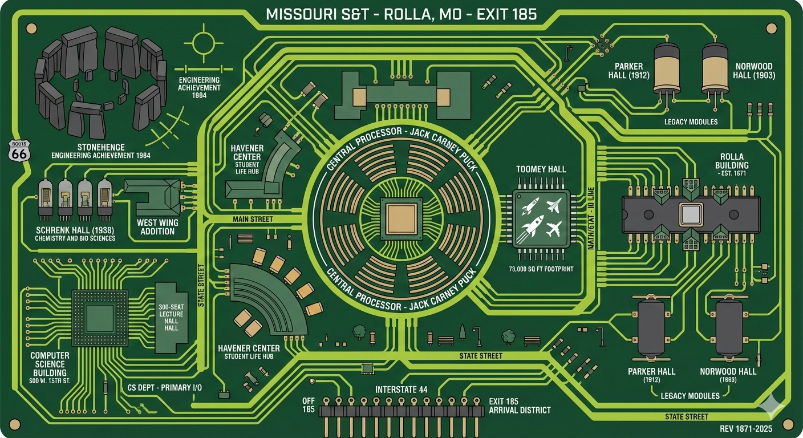

# academia

> 🎓 Pain is temporary, GPA is forever.

> **Note:** This repository is archived and read-only. It serves as a historical record of coursework completed between 2014-2018.

📚 **34 courses** · 📝 **147 assignments** · 📄 **1,113 pages** · 💻 **9 languages** · 🎓 **BS/MS Computer Science**

<p align="center">
  
</p>

Four years of computer science education distilled into one repository. From writing "Hello World" to implementing chess AIs—this is the complete journey through Missouri S&T's CS curriculum.

<p align="center">
  <a href="PORTFOLIO.md"><strong>View Portfolio &rarr;</strong></a>
</p>

---

## Coursework

### Foundational
- `CS 1001` **Data Structures Lab** Practical lab for CS 1510. C++, shell, LaTeX, Qt.
- `CS 1200` **Discrete Mathematics** Formal logic, set theory, proof techniques, induction, combinatorics, probability, relations, functions, matrices, graph theory.
- `CS 1510` **Data Structures** Lists, trees, heaps, hash tables, graphs.
- `CS 1570` **Introduction to Programming** Object-oriented design in C++. Syntax, operators, control flow, memory management, functions, file I/O, arrays, pointers, classes, templates, inheritance, polymorphism, exceptions.
- `CS 1580` **Introduction to Programming Lab** Practical lab for CS 1570. Debugging and testing.
- `CS 2200` **Theory of Computer Science** Computability, regular and context-free languages, recursively enumerable languages, P, NP, NP-completeness.
- `CS 2300` **Databases** Disk organization, index structures, B-trees, hash tables, ER models, relational models, relational algebra, SQL.
- `CS 2500` **Algorithms** Recurrence relations, algorithm analysis, dynamic programming, greedy methods, shortest-path, spanning trees, maximum flow.

### Systems & Software
- `CS 3001` **Professional Skills Development** Technical presentations.
- `CS 3100` **Software Engineering I** Software lifecycle: requirements, design, implementation, management, testing.
- `CS 3200` **Numerical Methods** Finite difference interpolation, numerical differentiation/integration, linear systems, nonlinear equations, differential equations.
- `CS 3500` **Programming Languages and Translators** Compiler/interpreter design. Syntax, variables, expressions, types, scope, functions.
- `CS 3800` **Operating Systems** Concepts, structure, mechanisms. Processes, concurrency, memory management, scheduling. Unix emphasis.
- `CpE 3150` **Micro/Embedded Design** Machine organization, interface design, C and assembly programming, real-time embedded systems.
- `CS 4096` **Software Systems Development** Teams prototype, deploy, and maintain software systems.
- `CS 4099` **Undergraduate Research** Control flow graph analysis.

### Graduate
- `CS 5200` **Analysis of Algorithms** Algorithm analysis techniques applied to sorting, backtracking, graph algorithms.
- `CS 5201` **Object-Oriented Numerical Modeling** Object-oriented modeling for scientific applications. Class library development for mechanics and engineering.
- `CS 5400` **Artificial Intelligence** Search, heuristics, game trees, knowledge representation, reasoning, computational intelligence, machine learning.
- `CS 5401` **Evolutionary Computing** Evolutionary algorithms, genetic programming, fitness functions, selection strategies, mutation, recombination.
- `CS 5402` **Data Mining** Classification, clustering, association analysis, data preprocessing, outlier detection.

### Math & Statistics
- `Math 1214` **Calculus I** Limits, derivatives, integration.
- `Math 1215` **Calculus II** Integration techniques, sequences, series.
- `Math 2100` **Foundations of Mathematics** Proof techniques.
- `Math 2222` **Calculus III** Multivariable calculus, partial derivatives, multiple integrals.
- `Math 3304` **Differential Equations** First-order and higher-order linear ODEs, Laplace transform, systems of linear equations, physical applications.
- `Stat 3117` **Statistics** Probability, distribution theory, statistical inference. Applications to physical and engineering sciences.

### Physics & Engineering
- `CpE 2210` **Introduction to Computer Engineering** Binary numbers, truth tables, Boolean algebra, Karnaugh maps, combinational/sequential logic, CMOS, programmable logic devices.
- `Phys 1135` **Physics I** Mechanics: kinematics, dynamics, statics, energetics.
- `Phys 2135` **Physics II** Electricity, magnetism, light.
- `Phys 2311` **Modern Physics I** An introduction to quantum mechanics, atomic physics, and solid state physics. Topics include historically important experiments and interpretations.

### Humanities
- `Phil 3225` **Business Ethics** Ethical frameworks in business contexts.
- `Psyc 1101` **Psychology 101** Psychological principles and behavior.

### Teaching

- `CS 1570` Lab Assignments (Lab 08, Lab 15)
- `CS 1570` Modern C++ Lecture (C++11/14 Features)
- Missouri S&T Satellite Team Git Tutorial
- ACM iOS Development With Swift 4 Presentation

### Side Projects

- **bolt** — iOS timer app with minimalist design
- **clc-tally** — iOS app for tracking student headcounts at the Computer Learning Center

## Technologies

| Language | Files | Usage |
|----------|-------|-------|
| C/C++ | 821 | Core coursework, systems programming, numerical modeling |
| Python | 263 | AI, data mining, automation |
| Swift | 63 | iOS apps (bolt, clc-tally) |
| Shell | 57 | Build scripts, automation |
| SQL | 21 | Database projects |
| MATLAB | 16 | Numerical methods |
| JavaScript | 13 | Web frontends |
| R | 7 | Statistics |

**Tools:** Make, CMake, Git, LaTeX, Doxygen, Xcode, Flex/Bison

## Repository Structure

```
src/           Course directories (cs1570-intro-to-programming, etc.)
latex/         LaTeX notes and teaching materials
review/        Course evaluation documents
```

## Getting Started

### Prerequisites

- **macOS/Linux** (tested on macOS)
- `g++` or `clang++` with C++17 support
- `make`
- `python3` and `pip` (for AI/data mining courses)
- Optional: `brew install boost` (for cs4099 research project)

### Build & Run

The repository has a unified build system. From the `src/` directory:

```bash
cd src

# Show all available commands
make help

# Install dependencies (boost, progressbar2)
make install

# Build all courses
make build-all

# Build a specific course
make cs5400-build

# Run targets in a course
make cs5400-run
```

For individual projects, you can also build directly:

```bash
cd src/cs5400-artificial-intelligence/puzzle-series/2018-sp-a-puzzle_1-isgx2
make
make run
```

## Contributors

- Tim Ott
- Ian Howell
- Claire Trebing
- Zachary Wileman
- Michael Schoen
- Abdirahman Ahmed Osman
- Adam Evans
- Eric Michalak
- Michael Harrington
- Deacon Seals
- Luke Parton
- Hunter Mathews
- William Thurman     
